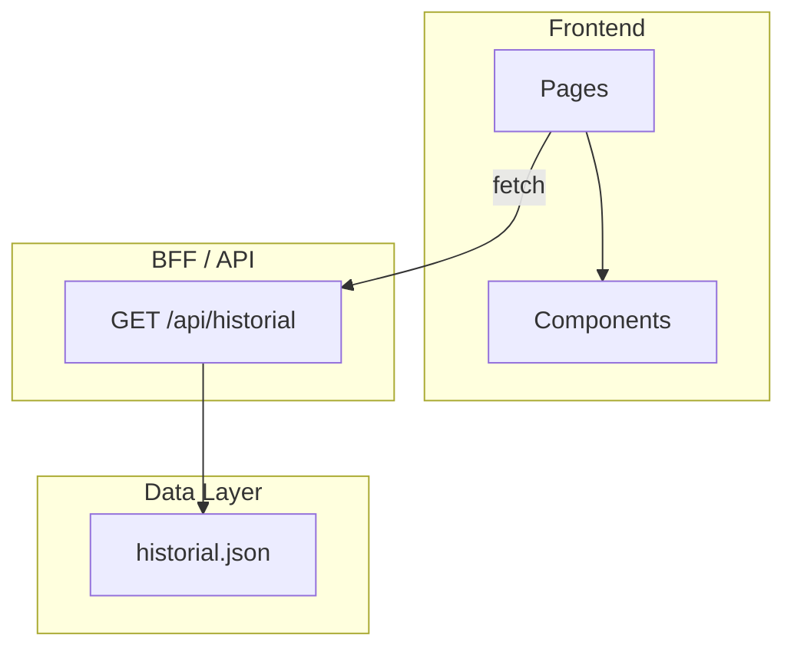
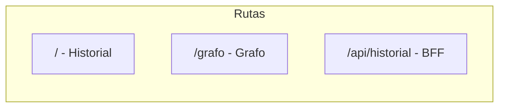

# Arquitectura - Historial Académico

## 1. Visión general

La aplicación sigue un patrón BFF (Backend for Frontend) con datos estáticos. El frontend consume una API que puede leer desde JSON u otra fuente. El grafo se renderiza en el cliente con librerías especializadas.

---

## 2. Diagrama de arquitectura



### Rutas



| Ruta | Propósito |
|------|-----------|
| `/` | Pantalla principal: historial, resumen, filtros |
| `/grafo` | Vista de grafo de correlativas |
| `/api/historial` | BFF: devuelve historial con filtro opcional |

---

## 3. Patrones de diseño

### BFF (Backend for Frontend)

- Endpoint `/api/historial` encapsula el acceso a datos.
- Soporta query `?filter=aprobadas|pendientes`.
- Permite reemplazar la fuente (JSON, base de datos) sin tocar el frontend.

### Layout con sidebar

- Sidebar fijo a la izquierda con navegación.
- Área de contenido principal con max-width para legibilidad.
- Sidebar colapsable (opcional).

### Filtrado en capas

- **Historial:** Filtrado client-side sobre datos iniciales (Todas | Aprobadas | Pendientes).
- **Grafo:** Filtrado por nodo seleccionado = subgrafo (nodo + prerequisitos + dependientes).

---

## 4. Estructura de carpetas sugerida

```
proyecto/
├── app/ o pages/          # Rutas de la aplicación
│   ├── layout.tsx         # Layout raíz (sidebar + contenido)
│   ├── page.tsx           # Ruta / - Historial
│   ├── grafo/
│   │   └── page.tsx       # Ruta /grafo
│   └── api/
│       └── historial/
│           └── route.ts   # BFF
├── components/
│   ├── layout/            # Sidebar, PageContainer
│   ├── historial/         # ResumenStats, FilterBar, HistorialTable, MateriaCard, StudentHeader
│   └── grafo/             # CorrelativasGraph, MateriaNode, MateriaNodeObsidian
├── lib/ o utils/          # Lógica de negocio
│   ├── historial.ts       # Filtros, contadores, getHistorial
│   └── graphUtils.ts      # materiasToFlowData, filterGraphByNode, layout
├── types/                 # Tipos / interfaces
│   └── historial.ts
├── data/                  # Datos estáticos
│   └── historial.json
```

---

## 5. Flujo de datos

### Carga inicial (Historial)

```
1. Página solicita datos (getHistorial() o fetch /api/historial)
2. BFF lee historial.json y aplica filtro si existe
3. Devuelve { student, materias }
4. Frontend renderiza ResumenStats + FilterBar + HistorialTable
5. FilterBar cambia estado -> filtrar materias client-side -> re-render tabla
```

### Carga del grafo

```
1. Página obtiene materias (mismo origen que historial)
2. materiasToFlowData(materias) -> { nodes, edges }
   - Agrupar materias por año
   - Crear nodo por materia (id = codigo, position según año)
   - Crear edge por cada correlativa: source = prerequisito, target = materia
3. Si Vista Obsidian: aplicar layout Dagre (LR) a nodes
4. React Flow / librería de grafos renderiza nodes + edges
5. Al seleccionar nodo: filterGraphByNode() -> subgrafo -> re-aplicar layout si Obsidian
```

### Transformación materias → grafo

| Concepto | Implementación |
|----------|----------------|
| Nodo | id = materia.codigo, data = { label: nombre, situacion, color, ... } |
| Arista | source = correlativa, target = materia (correlativa → materia) |
| Posición estándar | Por capas: x por año, y por índice en año |
| Posición Obsidian | Dagre layout con rankdir LR, nodesep, ranksep |

---

## 6. Recomendaciones técnicas

### Librería de grafos

- Usar una librería que soporte: nodos custom, edges, zoom/pan, selección.
- Ejemplos: React Flow, vis-network, D3, Cytoscape.js, sigma.js.

### Layout automático (Vista Obsidian)

- Dagre: bueno para grafos dirigidos, layout LR o TB.
- Alternativas: ELK (elkjs), d3-force (force-directed).

### Carga del grafo

- Si el framework hace SSR y la librería de grafos depende del DOM: cargar el componente del grafo con dynamic import y `ssr: false` (o equivalente).

### Colores por situación

- Definir paleta para modo claro y oscuro.
- Aprobadas: verde. A final / en curso: ámbar. Recursa: rojo. Pendiente: gris.

---

## 7. Schema del JSON de historial

### Estructura raíz

```json
{
  "student": { ... },
  "materias": [ ... ]
}
```

### Student

```json
{
  "nombre": "APELLIDO, NOMBRE",
  "lu": "1181713",
  "plan": "ING. EN INFORMÁTICA",
  "planCodigo": "1621",
  "documento": "43581083",
  "fechaNacimiento": "08/07/2001"
}
```

### Materia

```json
{
  "codigo": "3.4.069",
  "nombre": "FUNDAMENTOS DE INFORMATICA",
  "horas": 68,
  "situacion": "EQUIV_INTERNA",
  "nota": 9,
  "año": "PRIMER_AÑO",
  "correlativas": ["3.4.000"]
}
```

| Campo | Tipo | Requerido | Notas |
|-------|------|-----------|-------|
| codigo | string | Sí | Identificador único |
| nombre | string | Sí | |
| horas | number | Sí | |
| situacion | string | Sí | Ver REQUERIMIENTOS_FUNCIONALES.md |
| nota | number | No | Solo si tiene nota |
| año | string | Sí | PRIMER_AÑO, SEGUNDO_AÑO, ... OPTATIVAS, ANEXO |
| correlativas | string[] | No | Array de códigos de materias prerrequisito |

### Ejemplo mínimo

```json
{
  "student": {
    "nombre": "ALUMNO, NOMBRE",
    "lu": "1234567",
    "plan": "PLAN DE ESTUDIOS",
    "planCodigo": "1621"
  },
  "materias": [
    {
      "codigo": "M1",
      "nombre": "Materia 1",
      "horas": 68,
      "situacion": "PROMOCIONA",
      "nota": 8,
      "año": "PRIMER_AÑO"
    },
    {
      "codigo": "M2",
      "nombre": "Materia 2",
      "horas": 68,
      "situacion": "PENDIENTE",
      "año": "SEGUNDO_AÑO",
      "correlativas": ["M1"]
    }
  ]
}
```

---

## 8. Jerarquía de componentes

```
RootLayout
├── Sidebar (navegación, nombre alumno)
└── PageContainer
    └── children (según ruta)

Ruta /
├── StudentHeader
└── HistorialClient
    ├── ResumenStats (aprobadas, aFinalPrevio, pendientes)
    ├── FilterBar (tabs)
    └── HistorialTable
        └── MateriaCard (por materia, agrupadas por año)

Ruta /grafo
├── StudentHeader
├── texto instructivo
└── CorrelativasGraph
    ├── Toggle Vista Obsidian
    ├── Panel filtro (si nodo seleccionado)
    └── Canvas grafo
        ├── Nodos: MateriaNode | MateriaNodeObsidian
        ├── Edges
        ├── Background
        ├── Controls (zoom, fit)
        └── MiniMap
```

---

## 9. Uso para replicación

**Prompt sugerido:**

```
Tengo dos documentos: REQUERIMIENTOS_FUNCIONALES.md y ARQUITECTURA.md.
Implementá esta aplicación en [Next.js | Vue | Svelte | Angular | etc.] 
siguiendo los requerimientos funcionales y la arquitectura descrita.
Usá [framework/librería de grafos] para la vista de correlativas.
```
